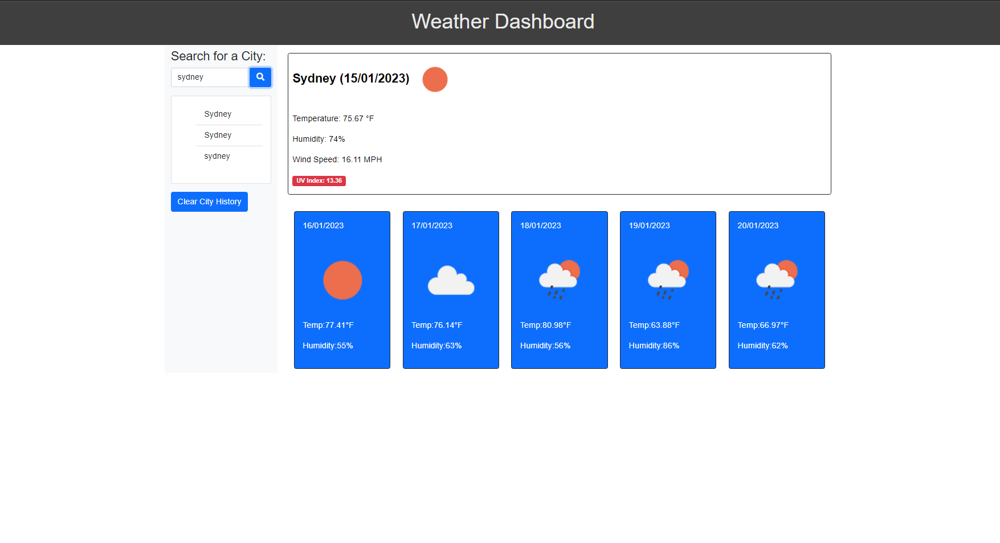

# Weather Dashboard

## Table of Contents

- [Overview](#overview)
- [Built With](#built-with)
- [Features](#features)
- [Contact](#contact)

## Overview


* This is the link to the live demo of the website
* Creating a Weather Dashboard with Server Side APIS
* Quite a challenging task this week but in the end got it working just like the demo.

## Screenshots of Dashboard


### Built With

* Javascript
* HTML
* CSS

## Features

Here is the Acceptance Criteria for this weeks Challenge.

```
GIVEN a weather dashboard with form inputs
WHEN I search for a city
THEN I am presented with current and future conditions for that city and that city is added to the search history
WHEN I view current weather conditions for that city
THEN I am presented with the city name, the date, an icon representation of weather conditions, the temperature, the humidity, and the wind speed
WHEN I view future weather conditions for that city
THEN I am presented with a 5-day forecast that displays the date, an icon representation of weather conditions, the temperature, the wind speed, and the humidity
WHEN I click on a city in the search history
THEN I am again presented with current and future conditions for that city

```


## Contact
LinkedIn: https://www.linkedin.com/in/andy-nguyen-b5b356256/
